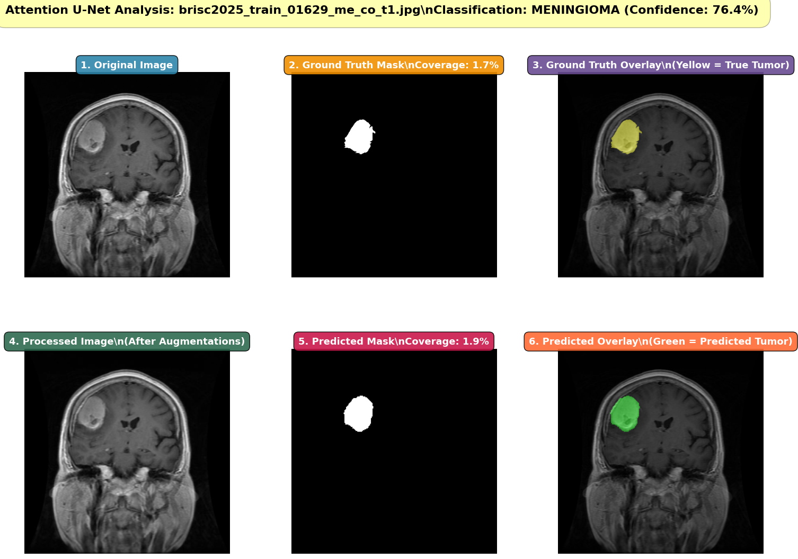
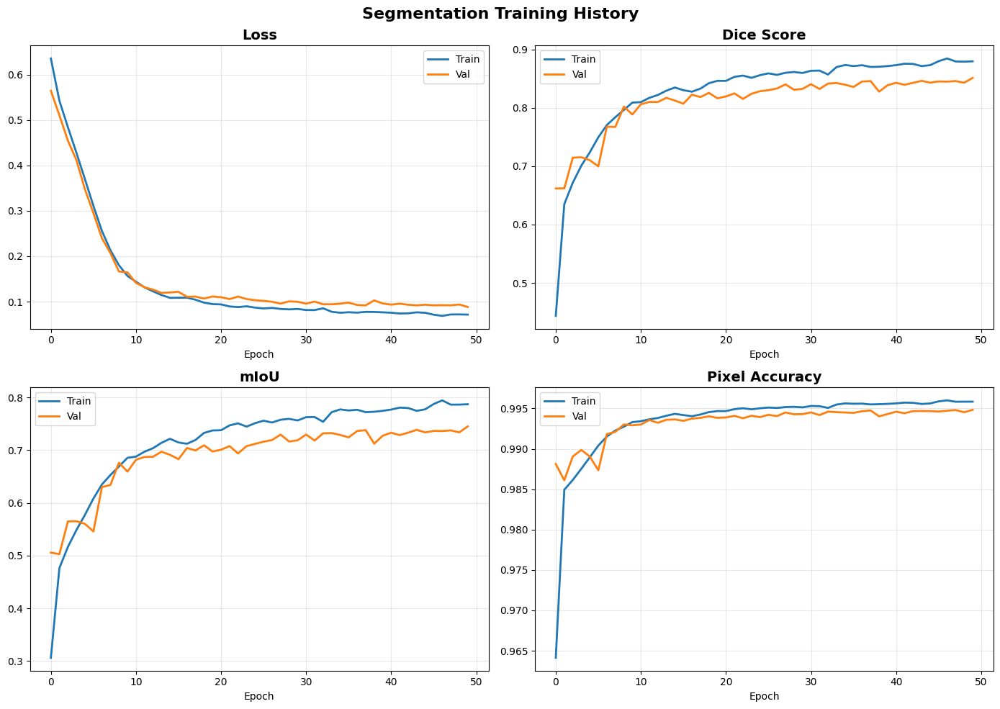
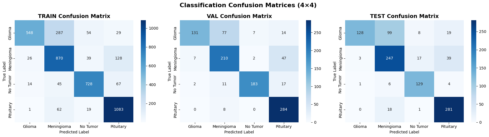
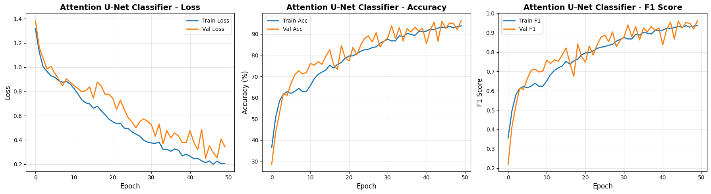

# Brain Tumor Segmentation & Classification (CSE428)

A two-stage deep learning pipeline for brain MRI. A **U-Net** segments the tumor, and its
frozen encoder features feed a **MobileNetV2** classifier for 4 tumor classes. The same
pipeline is then repeated with an **Attention U-Net**, and the two are compared.

Dataset: [BRISC2025](https://www.kaggle.com/datasets/briscdataset/brisc2025)
([paper](https://arxiv.org/abs/2506.14318)) has 6,000 T1-weighted MRI slices in four
classes (glioma, meningioma, no tumor, pituitary), with expert pixel masks.

<p align="center">
  <br>
  <em>Demo output: original image, ground-truth mask and overlay (top); processed image, predicted mask and overlay (bottom); predicted class.</em>
</p>

---

## Contents of this README

1. [What is in this package](#1-what-is-in-this-package)
2. [Quick start (5 steps)](#2-quick-start-5-steps)
3. [Detailed setup and what to expect](#3-detailed-setup-and-what-to-expect)
4. [How to check the result](#4-how-to-check-the-result)
5. [Quick code check without a GPU (a few minutes)](#5-quick-code-check-without-a-gpu-a-few-minutes)
6. [How the pipeline works](#6-how-the-pipeline-works)
7. [Models and hyperparameters](#7-models-and-hyperparameters)
8. [Results](#8-results)
9. [Data and rules compliance](#9-data-and-rules-compliance)
10. [Reproducibility notes](#10-reproducibility-notes)
11. [Troubleshooting](#11-troubleshooting)

---

## 1. What is in this package

```
.
├── notebooks/
│   └── brain_tumor_segmentation_classification.ipynb  # the whole pipeline (saved outputs included)
├── scripts/
│   ├── check_data.py          # checks the dataset is complete (optional SHA-256 check)
│   └── compare_results.py     # compares your run (outputs/) against results/
├── data/
│   └── README.md              # how to get BRISC2025 (the dataset itself is not committed)
├── results/                   # reference metrics from the original run (CSV)
├── figures/                   # EDA, training curves, confusion matrices, demo outputs
├── outputs/                   # created when you run the notebook (checkpoints + CSVs, git-ignored)
├── requirements.txt
└── README.md
```

| Not in the repo | Why | How you get it |
|---|---|---|
| BRISC2025 dataset (~295 MB) | Distributed by its authors on Kaggle | Downloaded by the notebook automatically, or placed in `data/brisc2025/` ([data/README.md](data/README.md)) |
| Model checkpoints (`*.pth`, ~375 MB per segmenter, ~14 MB per classifier) | Too large for git | Created by running the notebook |
| Course handout (`docs/`) | Instructor material | – |

## 2. Quick start (5 steps)

```bash
# 1. Clone
git clone https://github.com/MaishaMeherin/brain-tumor-segmentation-classification.git
cd brain-tumor-segmentation-classification

# 2. Create an environment (Python 3.10 or 3.11)
python3.11 -m venv .venv && source .venv/bin/activate     # Windows: .venv\Scripts\activate

# 3. Install dependencies
pip install -r requirements.txt

# 4. Get the data: either set up Kaggle credentials (the notebook downloads it),
#    or put the dataset in data/brisc2025/ and check it:
python scripts/check_data.py

# 5. Run the notebook top to bottom
jupyter lab notebooks/brain_tumor_segmentation_classification.ipynb      # then: Run → Run All Cells
```

When it finishes, checkpoints and metric CSVs are in `outputs/`. Compare them against the
reference run with `python scripts/compare_results.py`.

## 3. Detailed setup and what to expect

### Hardware

| | Full run | Quick check (§5) |
|---|---|---|
| Device | NVIDIA GPU, ≥ 8 GB VRAM recommended | CPU is fine |
| Time | several hours (four 50-epoch training stages) | a few minutes |
| Disk | ~300 MB data + ~800 MB checkpoints | ~300 MB data + ~800 MB checkpoints |

The reference run used an **NVIDIA RTX 4080 SUPER, CUDA 12.1, PyTorch 2.5.1, Python 3.10**.
Apple Silicon (MPS) is not used. The notebook picks CUDA if available, otherwise CPU.

### Installing PyTorch for your GPU

`pip install -r requirements.txt` installs the default PyTorch wheel. That wheel ships with
CUDA on Linux and is CPU-only on macOS. For a specific CUDA build, install PyTorch first and
then the rest:

```bash
pip install torch==2.5.1 torchvision==0.20.1 --index-url https://download.pytorch.org/whl/cu121
pip install -r requirements.txt
```

### Getting the data

The notebook's config cell resolves the dataset in this order:

1. `$BRISC_DATA_ROOT`, if set
2. `data/brisc2025/` in this repo, if it exists
3. Otherwise it downloads from Kaggle with `kagglehub` (cached in `~/.cache/kagglehub`).
   This needs a Kaggle API token in `~/.kaggle/kaggle.json`.

Details and the expected folder layout are in [data/README.md](data/README.md).

### What the notebook does, in order

| Section | What happens | Writes to `outputs/` |
|---|---|---|
| 0 Setup | Imports, seed 42, config, dataset paths | – |
| 1 EDA | Class counts and sample images for both tasks | – |
| 2–3 Data | Transforms, datasets, train/val split, loaders | – |
| 4 Models | U-Net and classifier head, with shape tests | – |
| 5 U-Net segmentation | 50 epochs, best checkpoint by val Dice, evaluation | `unet_seg_best.pth`, `segmentation_results.csv` |
| 6–7 U-Net classifier | 50 epochs on frozen U-Net encoder, best by val F1, confusion matrices | `classifier_best.pth`, `classification_results.csv` |
| 9–10 Attention U-Net | Same segmentation training with attention gates | `attention_unet_seg_best.pth`, `attention_unet_results.csv` |
| 11 Attention classifier | Classifier on frozen Attention U-Net encoder, plus comparisons | `attention_classifier_best.pth`, `attention_classifier_results.csv`, `attention_classifier_training.png` |
| Demo | 6-panel visualisation for any image, with both models | – (displayed inline) |

Each training cell prints loss, Dice/mIoU/pixel accuracy (or accuracy/F1) for every epoch,
and a `✓ Saved checkpoint` line whenever validation improves.

### Running the demo on your own image

After training (or once the four `.pth` files are in `outputs/`), call:

```python
demo_image_unet("/path/to/mri.jpg")
demo_image_attention_unet("/path/to/mri.jpg")
```

Each call shows six panels plus the predicted class and confidence. If the filename is a
BRISC2025 filename, the ground-truth mask is looked up in `segmentation_task/` and shown.
Otherwise those panels say "Ground Truth Not Available".

### Running headless

```bash
jupyter nbconvert --to notebook --execute --ExecutePreprocessor.timeout=-1 \
  --output executed.ipynb notebooks/brain_tumor_segmentation_classification.ipynb
```

## 4. How to check the result

1. **Every cell ran.** The summary cell at the end of section 11 lists all eight output
   files with `✓`.
2. **The metrics match the reference run.**

   ```bash
   python scripts/compare_results.py            # default tolerance ±0.02
   ```

   This prints reference vs. your run vs. difference for each split and file, and exits
   non-zero if anything is missing or outside tolerance.
3. **What "matching" means.** On the same GPU and software versions, numbers should agree
   to about the third decimal place. On different hardware, expect segmentation Dice
   within about ±0.01 and classification accuracy within a few points (see §10). The
   U-Net classifier (≈0.79 test accuracy) is the most run-to-run sensitive.
4. **Eyeball the plots.** Training curves should look like those in `figures/`. Val Dice
   should plateau around 0.85 for both segmenters.

## 5. Quick code check without a GPU (a few minutes)

Set `QUICK_RUN=1` to run the whole notebook end to end on a CPU. It trains every stage for
**1 epoch on 32 images per split**, so it shows that the code, data paths and
dependencies work. **It does not reproduce the results**, and its metrics will be low.

```bash
python scripts/check_data.py           # data in place? (needs data/brisc2025/)
QUICK_RUN=1 jupyter nbconvert --to notebook --execute --ExecutePreprocessor.timeout=-1 \
  --output quick_run.ipynb notebooks/brain_tumor_segmentation_classification.ipynb
```

On Windows PowerShell, use `$env:QUICK_RUN=1; jupyter nbconvert ...`. In Jupyter, start
the server with `QUICK_RUN=1 jupyter lab`.

Expected outcome: the command finishes without errors, `notebooks/quick_run.ipynb` contains
all outputs, and `outputs/` contains the four `.pth` files and four CSVs. A full quick run
took about **2 minutes** on an Apple M-series CPU (plus a one-time ~14 MB download of the
MobileNetV2 weights). Delete `outputs/` before a real
run, so `compare_results.py` does not pick up the quick-run CSVs.

## 6. How the pipeline works

```
                        ┌──────────────────────────── Stage 1: segmentation ───────────────────────────┐
 MRI slice  ──resize──▶ │ U-Net / Attention U-Net encoder ──▶ bottleneck (1024×16×16) ──▶ decoder ──▶ mask │
 (1×256×256) normalize  └───────────────────────────────────────────┬──────────────────────────────────┘
                                                                    │ frozen
                        ┌──────────────── Stage 2: classification ──▼──────────────────────────────────┐
                        │ 1×1-conv adapter (1024→512→3) ──▶ MobileNetV2 features (ImageNet) ──▶ MLP ──▶ 4 classes │
                        └──────────────────────────────────────────────────────────────────────────────┘
```

1. **Preprocessing.** Images are read as grayscale, resized to 256×256 and normalised with
   a fixed mean 0.5 / std 0.25. Training adds horizontal flips, ±15° rotations and
   brightness/contrast jitter (albumentations). Masks are binarised (`> 0`).
2. **Stage 1, segmentation.** The network is trained for binary tumor-vs-background
   segmentation with `0.5·Dice + 0.5·BCE`. The checkpoint with the best validation Dice is
   kept.
3. **Stage 2, classification.** The trained segmenter is **frozen**, and only
   `get_encoder_features()` is used. Its bottleneck tensor goes through a small adapter
   into a pretrained MobileNetV2 and an MLP head, trained with cross-entropy. The
   checkpoint with the best validation macro-F1 is kept.
4. **Attention variant.** Steps 2–3 are repeated with an Attention U-Net, which adds an
   attention gate on every skip connection
   ([Oktay et al., 2018](https://arxiv.org/abs/1804.03999)).
5. **Evaluation.** Metrics are reported on train, val and test for every model.
   Segmentation reports Dice, IoU and pixel accuracy at threshold 0.5. Classification
   reports accuracy and macro precision, recall and F1, plus confusion matrices.

The segmentation and classification heads are trained **separately** (sequentially), not
jointly.

## 7. Models and hyperparameters

| Model | Parameters | Details |
|---|---|---|
| U-Net | 31.04 M | 5 encoder levels, base 64 channels, `DoubleConv` = (Conv3×3 → BN → ReLU)×2, transposed-conv upsampling |
| Attention U-Net | 31.39 M | Same as U-Net, plus an additive attention gate (`F_int = C/4`) before each skip concatenation |
| Classifier head | 3.54 M trainable | Adapter 1024→512→3 (1×1 conv + BN + ReLU), MobileNetV2 `features` (ImageNet weights, trainable), GAP → [Dropout 0.5, FC 512, BN, ReLU] → [Dropout 0.4, FC 256, BN, ReLU] → [Dropout 0.3, FC 4] |

| Setting | Segmentation (both) | U-Net classifier | Attention U-Net classifier |
|---|---|---|---|
| Input | 1×256×256 | 1×256×256 | 1×256×256 |
| Loss | 0.5 Dice + 0.5 BCE | Cross-entropy | Cross-entropy |
| Optimizer | AdamW | AdamW | AdamW |
| Learning rate | 5e-5 | 5e-5 | **1e-4** |
| Weight decay | 1e-5 | 1e-5 | **1e-4** |
| LR schedule | ReduceLROnPlateau (max val Dice, ×0.5, patience 5) | ReduceLROnPlateau (max val F1, ×0.5, patience 3) | **none** |
| Epochs / batch size | 50 / 8 | 50 / 8 | 50 / 8 |
| Model selection | best val Dice | best val macro-F1 | best val macro-F1 |
| Seed | 42 | 42 | 42 |

All values live in the `Config` class (section 0.2 of the notebook). `SEG_WEIGHT`,
`CLS_WEIGHT` and `USE_GROUPNORM` are defined there but not used by the current pipeline.

**Data splits**

| Task | Train | Val | Test |
|---|---|---|---|
| Segmentation (tumor slices only) | 3,146 | 787 | 860 |
| Classification (all 4 classes) | 4,000 | 1,000 | 1,000 |

Validation is a seeded 80/20 split of the official training set (stratified by class for
classification). The official test set is used only for the final evaluation.

## 8. Results

Reference run. Full per-split numbers are in [`results/`](results/) and plots in
[`figures/`](figures/).

### Segmentation

| Model | Split | Dice | mIoU | Pixel Acc |
|---|---|---|---|---|
| U-Net | train / val / **test** | 0.8835 / 0.8511 / **0.8553** | 0.7935 / 0.7452 / **0.7551** | 0.9959 / 0.9948 / **0.9945** |
| Attention U-Net | train / val / **test** | 0.8901 / 0.8588 / **0.8562** | 0.8038 / 0.7565 / **0.7570** | 0.9961 / 0.9951 / **0.9947** |

The attention gates give a small, consistent gain: on average over the three splits,
**+0.005 Dice** and **+0.008 mIoU**.

### Classification (4 classes, macro-averaged)

| Encoder features from | Split | Accuracy | Precision | Recall | F1 |
|---|---|---|---|---|---|
| U-Net | train / val / **test** | 0.807 / 0.808 / **0.785** | 0.828 / 0.840 / **0.822** | 0.799 / 0.798 / **0.792** | 0.803 / 0.804 / **0.786** |
| Attention U-Net | train / val / **test** | 0.970 / 0.964 / **0.956** | 0.970 / 0.964 / **0.956** | 0.969 / 0.964 / **0.958** | 0.969 / 0.964 / **0.956** |

> **Caveat: this comparison is not fully controlled.** The two classifier heads have the
> same architecture, but they were trained with different optimizer settings (see the
> table in §7: learning rate, weight decay, and no LR scheduler for the attention head).
> So the ~17-point F1 gap comes from the encoder change **and** the hyperparameter change
> together. It should not be read as the effect of attention gates alone.

| | |
|---|---|
|  |  |
| U-Net segmentation training | Attention U-Net segmentation training |
|  |  |
| U-Net classifier confusion matrices | Attention U-Net classifier training |

## 9. Data and rules compliance

**Dataset.** BRISC2025 (Fateh et al., 2025) is used as published on
[Kaggle](https://www.kaggle.com/datasets/briscdataset/brisc2025). It is **not
redistributed** in this repository. Each user downloads it from the official source and
is bound by the license and terms on that page. The images are de-identified research
data. No other data, external pretraining on medical images, or test-set information is
used. The only external weights are the ImageNet-pretrained MobileNetV2 from `torchvision`.

**No test-set leakage.** Validation sets are carved out of the official training split
with a fixed seed. Model selection and LR scheduling use validation metrics only. The
official test split is evaluated once, with the selected checkpoints.

**Course requirements (CSE428 project brief).**

| Requirement | Where |
|---|---|
| U-Net for segmentation | Notebook §4.1, §5 |
| Classifier head on the encoder output | §4.3, §6–7 |
| Demo: any input image → original / GT mask / GT overlay / processed / predicted mask / predicted overlay | Demo section (`demo_image_unet`, `demo_image_attention_unet`). The title shows predicted class and confidence. Per-image IoU is not displayed. |
| Attention U-Net, segmentation retrained | §9–10 |
| EDA, per-epoch metrics and loss curves | §1, §5.4, §6.5, §10, §11 |
| mIoU, Dice and pixel accuracy (seg); accuracy, precision, recall and F1 (cls) on train, val and test | §5.5, §7.1, §10, §11 and `results/` |

Bonus tasks from the brief (joint vs. separate training, comparing classifier backbones,
hyperparameter sweeps, an EfficientDet decoder) were **not** carried out. `RUN_BONUS` in
the config is a placeholder and has no effect.

**Not for clinical use.** This is coursework, and the models have not been validated for
diagnosis.

## 10. Reproducibility notes

- **Seeds.** `set_all_seeds(42)` seeds `random`, NumPy and PyTorch (CPU and CUDA), and sets
  `cudnn.deterministic=True` and `cudnn.benchmark=False`. Train/val splits use
  `random_state=42`, so they are identical on every machine.
- **Still not bit-exact.** Some CUDA kernels (e.g. the backward pass of transposed
  convolutions) are non-deterministic. Results also change slightly with the GPU model,
  CUDA/cuDNN version and library versions. Seeds are set once at the top, so re-running
  single cells out of order changes the random stream. For the closest match, run all
  cells top to bottom in a fresh kernel.
- **Pinned versions.** `torch==2.5.1` and `torchvision==0.20.1` are pinned, as in the
  reference run. Newer PyTorch (≥ 2.6) changes `torch.load` to `weights_only=True` by
  default, which can fail on these checkpoints (they store training history). Other
  packages have tested version ranges in `requirements.txt`.
- **Normalisation statistics** are fixed constants (mean 0.5, std 0.25), not computed from
  the data. The notebook does not depend on a statistics pass.
- **Where files go.** The config cell switches the working directory to `outputs/`, so all
  checkpoints and CSVs land there no matter where Jupyter was started.
- **Reference metrics.** `results/*.csv` were copied from the saved outputs of the
  reference run, which are also visible in the committed notebook.

## 11. Troubleshooting

| Problem | Fix |
|---|---|
| `kagglehub` asks for credentials, or returns 401/403 | Create an API token at kaggle.com → Settings → API, save it as `~/.kaggle/kaggle.json` (`chmod 600`). Or download the dataset manually into `data/brisc2025/`. |
| `ERROR: DATA_ROOT not found!` / `No images found` | Run `python scripts/check_data.py`. The folder must contain `classification_task/` and `segmentation_task/` directly (not nested one level deeper). |
| `FileNotFoundError: unet_seg_best.pth` (or another `.pth`) | A later cell ran before the training cell that creates the checkpoint. Run all cells in order. Checkpoints are in `outputs/`. |
| CUDA out of memory | Lower `BATCH_SIZE` in `Config` (e.g. 4) and close other GPU processes. |
| Training is extremely slow | You are probably on CPU (the first cell prints `Device`). Install a CUDA build of PyTorch (§3), or use `QUICK_RUN=1` for a smoke test. |
| `torch.load` error mentioning `weights_only` | You have PyTorch ≥ 2.6. Install the pinned `torch==2.5.1`, or pass `weights_only=False` to the `torch.load` calls. |
| `TypeError: ... unexpected keyword argument 'verbose'` (ReduceLROnPlateau) | Newer PyTorch versions deprecate and then remove this argument. Use the pinned version, or delete `verbose=True`. |
| Warnings about `pretrained` being deprecated (torchvision) | Harmless with the pinned version. |
| `SSL: CERTIFICATE_VERIFY_FAILED` when downloading weights or data (macOS) | Python from python.org ships without CA certificates. Run `/Applications/Python 3.x/Install Certificates.command`, or `export SSL_CERT_FILE=$(python -c "import certifi; print(certifi.where())")` before starting Jupyter. |
| Error downloading `mobilenet_v2` weights | The ImageNet weights are fetched from download.pytorch.org on first use. You need internet access once; they are then cached in `~/.cache/torch`. |
| Demo shows the wrong ground-truth mask | The demo matches masks by the numeric index in the filename only, and train and test indices overlap. Treat the GT panels as reliable only for images from `segmentation_task/test/`. |
| `ImportError` from albumentations or NumPy 2.x | Reinstall with `pip install -r requirements.txt` in a fresh venv. The file caps `numpy<2`. |
| Metrics differ from `results/` by more than the tolerance | Check that you ran the full schedule (not `QUICK_RUN`), deleted old `outputs/` first, and used the pinned versions. See §10 for expected variation. |

## Citation

```bibtex
@article{fateh2025brisc,
  title   = {BRISC: Annotated Dataset for Brain Tumor Segmentation and Classification with Swin-HAFNet},
  author  = {Fateh, Amirreza and Rezvani, Yasin and Moayedi, Sara and Rezvani, Sadjad and Fateh, Fatemeh and Fateh, Mansoor and Abolghasemi, Vahid},
  journal = {arXiv preprint arXiv:2506.14318},
  year    = {2025}
}
```

U-Net: Ronneberger et al., 2015 ([arXiv:1505.04597](https://arxiv.org/abs/1505.04597)) ·
Attention U-Net: Oktay et al., 2018 ([arXiv:1804.03999](https://arxiv.org/abs/1804.03999)) ·
MobileNetV2: Sandler et al., 2018 ([arXiv:1801.04381](https://arxiv.org/abs/1801.04381))

Coursework for CSE428, Fall 2025.
